 

Software engineer and machine learning researcher building useful systems where software, language, and hardware meet.

 
 

<a href="mailto:retieflouw@gmail.com">Email</a>
&nbsp; · &nbsp;
<a href="https://www.linkedin.com/in/retieflouw/">LinkedIn</a>

## Skills

Machine learning · Speech and LLMs · Python · IoT · Automation · Data science · Mechatronics

## Experience

**MEng electronic research · Stellenbosch University** 
Machine-learning applications for speech technology and large language models in South African and under-resourced language contexts.

**Biomedical manufacturing** 
Optimised and digitised manufacturing processes through IoT control systems.

**Aerospace automation and electronics** 
Built automation tooling and designed a stress-testing PCB for self-piloting electronics.

## Achievements

- Cum Laude in every year of the BEng Mechatronics degree.
- Ranked among the top three engineering students at Stellenbosch University in 2020.
- Placed third nationally in the Red Bull Basement entrepreneurship competition.

## Example work

| Project | Focus |
| --- | --- |
| Township Health-Tech | Clinical scheduling and conversational AI for improved healthcare access. |
| Thermal Imaging Drone Patrol | Drone security concept combining thermal imaging and human detection. |
| Automated Flood Mitigation | Rural flood-protection design recognised as a national finalist. |

