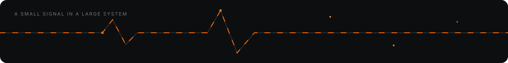

 

Software engineer and machine learning researcher building useful systems at the edge of software, language, and hardware.

 
 

<a href="mailto:retieflouw@gmail.com">Email</a>
&nbsp; · &nbsp;
<a href="https://www.linkedin.com/in/retieflouw/">LinkedIn</a>

## Skills

`Machine Learning` `Speech & LLMs` `Python` `IoT` `Automation` `Data Science` `Mechatronics`

## Experience

**MEng Electronic Research · Stellenbosch University**  
Researching machine-learning applications for speech technology and large language models in South African and under-resourced language contexts.

**Software & Digitalisation · Sinapi Biomedical**  
Optimised and digitised biomedical manufacturing processes through IoT control systems.

**Automation & Electronics · S-Plane Automation**  
Built aerospace automation tooling and designed a stress-testing PCB for self-piloting electronics.

## Selected work

| Project | Focus |
| --- | --- |
| Township Health-Tech | Clinical scheduling and conversational AI for improved healthcare access. |
| Thermal Imaging Drone Patrol | Drone security concept combining thermal imaging and human detection. |
| Automated Flood Mitigation | Rural flood-protection design recognised as a national finalist. |

*Build carefully. Keep the signal clear.*

